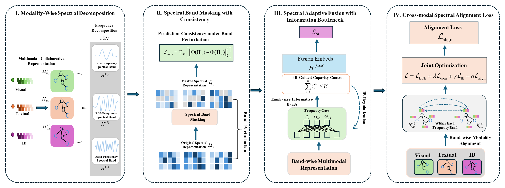

# SAFIB

The official source code for **SAFIB: Spectral Adaptive Fusion with Information Bottleneck for Incomplete Multimodal Recommendation**.

## Overview

SAFIB is a multimodal recommendation framework designed for missing modality scenarios. It decomposes user and item representations into spectral bands, applies adaptive task-aware frequency fusion, and uses an information bottleneck objective to learn robust representations. The implementation also supports spectral band masking as a consistency regularizer for missing-modality robustness.

This repository follows a single `src/` code tree. Missing modality ratio and user cold-start evaluation are controlled from `main.py` arguments instead of being hard-coded into model config files.

## Framework

## Environment

    conda create -n [env name] python=3.10
    conda activate [env name]
    pip install -r requirements.txt

## Dataset

Download Baby/Sports/Clothing data from the MMRec-style dataset release and place each dataset under `data/[dataset]/`.

The expected directory format is:

    data/
    |-- preprocess_missing_modality.py
    |-- baby/
    |   |-- baby.inter
    |   |-- image_feat.npy
    |   `-- text_feat.npy
    |-- sports/
    `-- clothing/

Only `data/preprocess_missing_modality.py` is included in this repository. Raw interaction files, feature files, generated missing-item files, logs, and checkpoints are intentionally excluded.

## Missing Modality Setting

    cd data
    python preprocess_missing_modality.py --dataset [dataset] --missing_ratio [missing_ratio]

After running the script, it will produce `missing_items_[missing_ratio].npy` in `./data/[dataset]/`.

## Training / Test

    cd src
    python main.py --model SAFIB --dataset [dataset] \
        --gpu_id 0 \
        --missing_modal 1 \
        --missing_ratio 0.666 \
        --user_cold_start 0

For user cold-start evaluation:

    cd src
    python main.py --model SAFIB --dataset [dataset] \
        --gpu_id 0 \
        --missing_modal 1 \
        --missing_ratio 0.666 \
        --user_cold_start 1

## Configuration

Model hyperparameters are stored in:

    src/configs/model/SAFIB.yaml

Dataset-specific settings are stored in:

    src/configs/dataset/

General training and evaluation settings are stored in:

    src/configs/overall.yaml

Runtime experiment parameters such as `missing_ratio` and `user_cold_start` are passed through `main.py`.

## Repository Structure

    SAFIB/
    |-- data/
    |   `-- preprocess_missing_modality.py
    |-- src/
    |   |-- common/
    |   |-- configs/
    |   |-- models/
    |   |-- utils/
    |   `-- main.py
    |-- figures/
    |   `-- SAFIB_framework.png
    |-- README.md
    `-- requirements.txt
